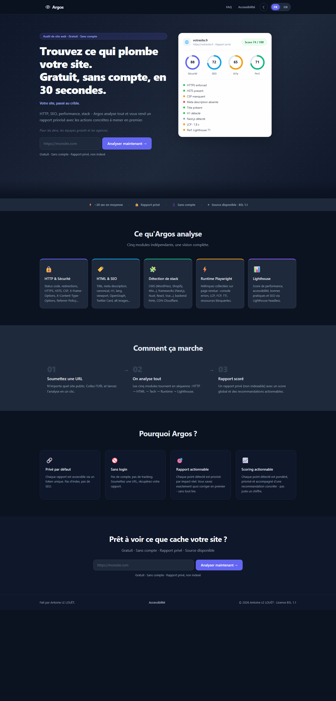
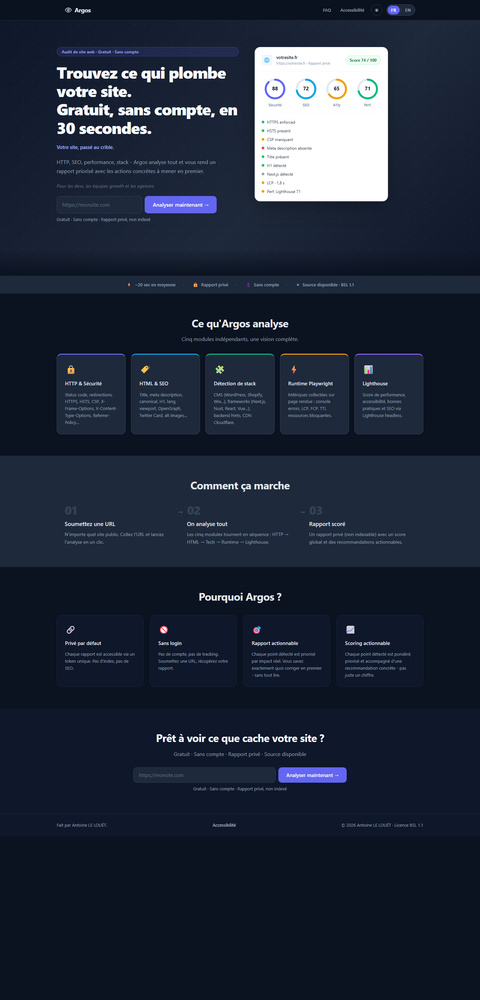

# Espacements de l'interface

Inventaire et règles appliqués dans l'issue #140. Les valeurs sont définies dans `apps/console-web/src/styles/_tokens.scss` et utilisées par les modules SCSS des pages et composants.

## Échelle

| Usage | Bureau | Mobile (≤ 640 px, ou seuil propre à la page) |
| --- | ---: | ---: |
| Gouttière de page | 24 px | 16 px |
| Espace vertical d'une section | 64 px | 48 px |
| Rembourrage d'un panneau | 24 px | 16 px |
| Écart courant entre éléments | 8, 12, 16, 24 ou 32 px | même échelle, selon la densité |
| Cible interactive principale | au moins 44 px de hauteur | au moins 44 px de hauteur |

Les puces et filtres secondaires utilisent une cible de 40 px au minimum. Les titres et listes conservent leur rythme typographique ; l'échelle ne remplace pas les marges nécessaires à la lecture de longs articles.

## Inventaire

| Surface | Éléments harmonisés | Exception conservée |
| --- | --- | --- |
| Accueil | navigation, hero, sections, cartes, formulaire | hero plus ample pour la composition avec l'aperçu du rapport |
| Rapport | conteneur, hero, scores, priorités, couverture, progression, erreur et CTA | progression sur fond sombre et graphiques dimensionnés par contenu |
| Dashboard | conteneur, filtres, liste d'audits, cartes KPI | grille adaptable au nombre de colonnes |
| Connexion | conteneur, formulaire, champs et bouton | largeur maximale du formulaire |
| FAQ | hero, contenu, accordéons et CTA | espacement entre groupes de questions |
| Accessibilité numérique | hero, article, sommaire et encarts | rythme des paragraphes et ancrages du sommaire |
| Page introuvable | conteneur et actions | grand code 404 comme élément graphique |
| Navigation et footer partagés | gouttières et disposition mobile | hauteur fixe de la barre de navigation |

Les surfaces sans maquette spécifique gardent leurs tailles de contenu, mais leurs marges et rembourrages extérieurs suivent la même échelle. Les couleurs, la typographie et les points de rupture existants restent ceux des composants.

## Comparaison

Accueil en français, thème sombre, largeur 1440 px :

| Avant | Après |
| --- | --- |
|  |  |

## Vérification

Compilation de production, ESLint et suite Vitest du frontend. L'accueil a été contrôlé à 390, 768 et 1440 px en français et en anglais, en thème sombre, puis à 390 px en thème clair. FAQ, accessibilité numérique, connexion et page introuvable ont été contrôlées en anglais à ces largeurs. Aucun défilement horizontal n'a été observé. Les pages sans données réelles (rapport publié, dashboard authentifié) sont couvertes par leurs composants et par les tests existants ; les états de progression et d'erreur ont été inspectés dans leurs modules SCSS.
